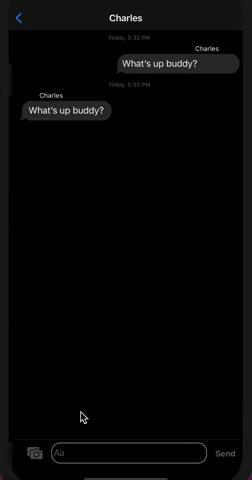

#  Messaging App

  

## Purpose
Example app to show how to build basic chat functionality. 

## Dependencies
- Cloud Firestore to store message groups / messages and handle snapshot diffs.
- Firebase Store to store images.
- Firebase Authentication to login users.
- MessageKit to render chat style UI.

## Dev Tools
- Xcode 12.3
- Swift 5.3.2
- Cocoapod 1.10.0

## Firebase Configuration
- Create a Firebase project in Firebase portal. 
- Create an iOS App for this project. 
- Download GoogleService-Info.plist from Firebase portal and add to the iOS project.
- Allow anonymous authentication in Firebase.
- Provision Cloud Firestore and Storage.

## How does it work?
- When the app launches, user will need to login as anonymous user providing a user name. This is executed by `Auth.auth().signInAnonymously(completion: nil)` which creates an anonymous user.

- Create a Mesage Group by entering group name. This data is serialized and stored in Cloud Firestore. On saving, `ListenerRegistration` will get the snapshot changes and creates `MessageGroup` object and reloads tableview with new changes.

- Messages are handled the same way. Any message sent is serialized and sent to Cloud Firestore and listeners receive the snapshots and creates `ChatMessage` object with `kind` as `.text(content)`and reloads `MessagesCollectionView`.

- If the message is a picture, it is compacted and uploads to `Firebase Storage` and gets `downloadURL`.  This URL along with other message properties are serialized and send to Cloud Firestore. Listeners gets the changes and downloads the image from URL and will create `ChatMessage` object with `kind` as `.photo(imageMediaItem)` and reloads `MessagesCollectionView`.

